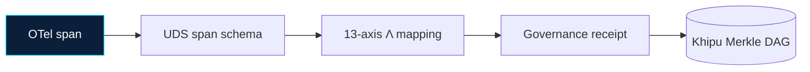

> **Trademark notice.** SZL Holdings' use of "UDS" references Defense Unicorns' Unicorn Delivery Service (USPTO Serial 99831126). SZL Holdings is not affiliated with Defense Unicorns. SZL contributions to the UDS ecosystem are made through upstream PRs. See: https://defenseunicorns.com/uds

<div align="center">

# uds-mesh

<!-- series-a-badges (Doctrine v11) -->
[](https://github.com/szl-holdings/uds-mesh/security/dependabot)


**Service mesh integration for SZL on Defense Unicorns UDS.**

[](https://github.com/szl-holdings/.github/tree/main/doctrine) [](https://www.apache.org/licenses/LICENSE-2.0) [](https://doi.org/10.5281/zenodo.20434276)

[](https://github.com/szl-holdings/uds-mesh/actions/workflows/ci.yml) [](https://github.com/szl-holdings/uds-mesh/actions/workflows/tests.yml) [](https://github.com/szl-holdings/uds-mesh/actions/workflows/codeql.yml) [](https://github.com/szl-holdings/uds-mesh/actions/workflows/sbom.yml) [](https://github.com/szl-holdings/uds-mesh/actions/workflows/dco.yml) [-0B1F3A.svg?style=flat-square)](https://slsa.dev/spec/v1.0/levels) [](https://securityscorecards.dev/viewer/?uri=github.com/szl-holdings/uds-mesh) [](https://github.com/szl-holdings/uds-mesh/security/code-scanning) [](https://orcid.org/0009-0001-0110-4173)

[Hugging Face](https://huggingface.co/SZLHOLDINGS) · [GitHub Org](https://github.com/szl-holdings)

`receipts.in ≡ receipts.out`

</div>

---

> A measurable governance operator on the receipt-bus σ-algebra of agentic AI — deployed as a UDS-packageable bundle with cosign-signed attestations and DSSE-wrapped governance receipts at every span boundary.

---


## Architecture



> 13-axis canonical trust schema. Doctrine v11.

## What this is

**uds-mesh** is the Defense Unicorns UDS service mesh integration for the SZL Holdings governed AI platform. It packages the Ouroboros span schema layer as a UDS-deployable bundle (`uds-bundle.yaml`), emits DSSE-wrapped governance receipts, and enforces gRPC/Protobuf span contracts across component boundaries. The A15 ELZ (persistent-homology) invariant guarantees that no audit fiber is severed at a mesh boundary — axiom-structured, pending full `lake build` discharge in lutar-lean.

## Why it matters

Regulated AI deployments need provenance that survives network hops. uds-mesh makes every cross-component span a first-class governance event: signed, hash-chained, and verifiable without SZL tooling. The UDS-bundle output format aligns with Defense Unicorns deployment contracts, making this the bridge between the SZL governance substrate and DoD-compatible infrastructure.

## Quickstart

```bash
pip install -e .
pytest tests/                          # 163 tests (33 schema + 20 chain + 17 bundle + 93 formula)
python uds_v18_24_substrate.py         # 269 substrate self-tests
```

To validate the bundle manifest:

```bash
cat uds-bundle.yaml                    # review bundle spec
ls bundles/v0.3.1-demo/               # cosign-ready demo bundle
```

## Key files

| Path | Role |
|------|------|
| `uds-bundle.yaml` | UDS package manifest — top-level bundle spec |
| `bundles/v0.3.1-demo/uds-bundle.yaml` | Versioned demo bundle (cosign-ready) |
| `schemas/spans/a11oy.graph.yaml` | Canonical span schema for the a11oy governance graph |
| `pepr/governance-receipts-pqc.ts` | PQC-upgraded receipt signing (ML-DSA-65 + HMAC-SHA-256 dual-sign, STAGED v0.4.0-alpha.1) |
| `uds_v18_24_substrate.py` | Substrate self-test harness (269 assertions) |
| `tests/test_span_schemas.py` | Span schema pytest suite (33 tests) |
| `tests/test_attestation_chain.py` | DSSE receipt chain tests (20 tests) |
| `tests/test_bundle_manifests.py` | Bundle manifest tests (17 tests) |
| `tests/test_formula_receipts.py` | Formula receipt tests (93 tests) |
| `extended-attestations.jsonl` | Extended attestation chain artifacts |

## Related

| Repo | Role |
|------|------|
| [ouroboros](https://github.com/szl-holdings/ouroboros) | Core runtime that emits receipts |
| [ouroboros-thesis](https://github.com/szl-holdings/ouroboros-thesis) | Formal research paper (DOI [10.5281/zenodo.20434276](https://doi.org/10.5281/zenodo.20434276)) |
| [lutar-lean](https://github.com/szl-holdings/lutar-lean) | Lean 4 proofs — 749 decls / 15 raw axioms / 163 sorries @ HEAD c7c0ba17 |
| [vsp-otel](https://github.com/szl-holdings/vsp-otel) | OTel + DSSE attestation exporter |
| [a11oy](https://github.com/szl-holdings/a11oy) | Flagship governance app |
| [amaru](https://github.com/szl-holdings/amaru) | Cardano anchoring layer |
| [sentra](https://github.com/szl-holdings/sentra) | Policy enforcement engine |
| Hatun Doctrine Specification | [szl-holdings/platform/docs/a11oy/spec/hatun-doctrine-spec/](https://github.com/szl-holdings/platform/tree/main/docs/a11oy/spec/hatun-doctrine-spec/) |

## Citation

See [CITATION.cff](./CITATION.cff) for machine-readable metadata. Quick reference:

```
S. P. Lutar Jr., "uds-mesh — Service mesh integration for SZL on Defense Unicorns UDS,"
SZL Holdings, 2026. https://github.com/szl-holdings/uds-mesh
```

Preferred citation: [The Ouroboros Substrate (v18.0)](https://doi.org/10.5281/zenodo.20434276), DOI 10.5281/zenodo.20434276.

## License · Trust · Security

[Apache 2.0](./LICENSE). SLSA Level 1 (source + build provenance documented; L2/L3 require Sigstore + isolated builders — roadmap). All governance receipts are deterministic and independently verifiable. Security disclosures: see [SECURITY.md](./SECURITY.md).
